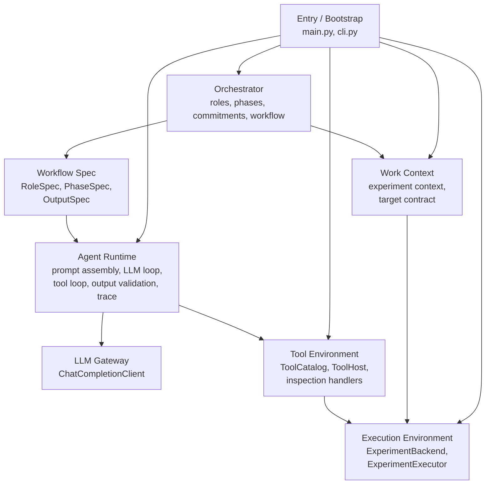

# autoresearch-sidecar

`autoresearch-sidecar` is a small sidecar agent for Karpathy-style `autoresearch` repositories.

It is not a replacement for the target training repo. Instead, it attaches to an existing repo, reads its `train.py` / `prepare.py` contract, writes isolated experiment variants under `namespace/<node_id>/`, runs them, and keeps iterating.

## What It Is

- **Entry / Bootstrap**
- `main.py`: thin repository-root entrypoint
- `autoresearch_sidecar/cli.py`: CLI wiring, env loading, and application bootstrap
- **Orchestrator**
- `autoresearch_sidecar/orchestrator.py`: iteration orchestration over proposals, implementation, and execution
- `autoresearch_sidecar/orchestrator_factory.py`: builds planner and implementer workflows from work context
- `autoresearch_sidecar/orchestrator_validators.py`: proposal and train.py validation helpers
- **Workflow Spec**
- `autoresearch_sidecar/workflow_spec.py`: role / phase / output contracts consumed by the runtime
- **Agent Runtime**
- `autoresearch_sidecar/agent_runtime.py`: prompt assembly, LLM loop, tool loop, and phase execution
- `autoresearch_sidecar/agent_trace.py`: trace helpers and diff utilities
- **Tool Environment**
- `autoresearch_sidecar/tool_environment.py`: tool catalog, tool host, and tool call parsing
- `autoresearch_sidecar/backend_protocol.py`: backend port and inspection tool boundaries
- **Work Context**
- `autoresearch_sidecar/work_context.py`: static experiment context and target contract
- `autoresearch_sidecar/experiment_contract.py`: target-repo contract manifest
- **Execution Environment**
- `autoresearch_sidecar/experiment_backend.py`: experiment persistence, inspection, and execution state
- `autoresearch_sidecar/experiment_executor.py`: async experiment execution worker
## Architecture



## Target Repo Assumptions

The default experiment contract is built for the Karpathy `autoresearch` training shape:

- the target repo has a root-level `train.py`
- the target repo has a root-level `prepare.py`
- the metric is printed as `val_bpb:`
- peak memory is printed as `peak_vram_mb:`

The current implementation protects against the implementer silently switching to a different project layout or dataset convention.

## Quick Start

Requirements:

- Python 3.10+
- `uv`
- an OpenRouter-compatible API key in `.env` or the shell environment
- a prepared target repo with data/tokenizer already available

Create `.env` from the template:

```bash
cp .env.example .env
```

Run against a target repo:

```bash
uv run python3 main.py --repo-root /path/to/autoresearch-repo
```

Or use the package entrypoint:

```bash
uv run autoresearch-sidecar --repo-root /path/to/autoresearch-repo
```

If `autoresearch-sidecar` itself is the current repo root:

```bash
uv run python3 main.py
```

Useful flags:

```bash
uv run python3 main.py --help
```

## Example

Run one debug iteration against a target repo:

```bash
uv run python3 main.py \
  --repo-root /path/to/autoresearch-repo \
  --max-iterations 1 \
  --debug
```

## Environment

`main.py` loads environment variables in this order:

1. existing shell environment
2. `<repo-root>/.env`
3. `<cwd>/.env` if different from `<repo-root>`

Shell environment variables win.

Relevant variables:

- `OPENROUTER_API_KEY`
- `OPENROUTER_BASE_URL`
- `AUTORESEARCH_MODEL`

## Repository Layout

```text
.
├── README.md
├── LICENSE
├── pyproject.toml
├── .gitignore
├── .env.example
├── main.py
├── tests/
└── autoresearch_sidecar/
    ├── __init__.py
    ├── cli.py
    ├── agent_runtime.py
    ├── work_context.py
    ├── workflow_spec.py
    ├── tool_environment.py
    ├── agent_trace.py
    ├── backend_protocol.py
    ├── experiment_contract.py
    ├── experiment_backend.py
    ├── experiment_executor.py
    ├── orchestrator.py
    ├── orchestrator_factory.py
    └── orchestrator_validators.py
```

`tests/` stays at the repository root while active application code lives under `autoresearch_sidecar/`.

## Contributors

- Mingli Yuan
- Wenhao Li

## License

MIT
